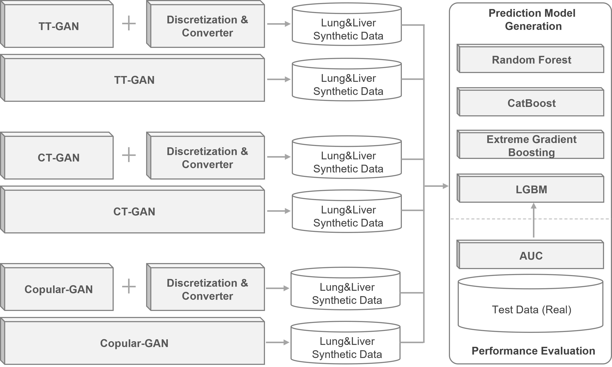

# Transformer Tabular Generative Adversarial Networks (TTGAN)
TTGAN is transformer-based generative adversarial network model for tabular data.

## Installation
Use the package manager [pip](https://pip.pypa.io/en/stable/) to install all required packages. All code has been tested on Python 3.9.0.

```bash
pip install -r requirements.txt
```

## Overview
The general overview of preprocessing, training, and evaluation steps is visualized as follows:



## Data preparation
Prepare your data by placing it into the *"data/original/{dataset_name}*" folder and splitting it into three subsets: training, validation, and test. The distribution should be 70%, 20%, and 10% of the data, respectively.

For example:

    data/original/{dataset_name}/train.csv
    data/original/{dataset_name}/val.csv
    data/original/{dataset_name}/test.csv

### Columns Configuration
The dataset's column structure is defined by a manually created JSON file named 'columns.json,' which contains information about column names, types, and data types.

The *"data/original/{dataset_name}/columns.json"* file is structured as follows:

```json
[
    {
        "name"      : "age",
        "type"      : "numerical",
        "dtype"     : "int"
    },
    {
        "name"      : "gender",
        "type"      : "categorical",
        "dtype"     : "int"
    },
    ... Other columns ...
    {
        "name"      : "10_year_death_event",
        "type"      : "categorical",
        "dtype"     : "int",
        "target"    : "True"
    }
]
```

## Preprocessing
In this work, two fundamental preprocessing methods were employed to prepare the data for modeling: ordinal encoding for string features and discretization for continuous features.

### Ordinal Encoding for String Features
String-based categorical features were transformed using ordinal encoding. This method assigns numerical labels to categorical values, preserving their order or ranking within the feature.

### Discretization for Continuous Features
Continuous features underwent a discretization process, converting them into categorical bins or intervals. This method is valuable for handling continuous data more effectively by segmenting it into distinct categories.

To execute the preprocessing steps, run the following command:

```python
python preprocess.py --name {dataset_name}
```

The encoded results are stored in the *"data/original/{dataset_name}/encoded"* folder and the discretized results are stored in the *"data/original/{dataset_name}/discretized"* folder.

## Training Predictor Models
The objective was to develop predictor models that anticipate continuous values based on discretized categorical inputs. This predictive task involved employing ensemble algorithms. The default configurations for each algorithm were employed during training.

### Predictive Algorithms:
    Random Forest (RF)
    CatBoost (CB)
    XGBoost (XGB)
    LightGBM (LGBM)

To initiate the training process for a specific predictive model, use the following command:

```python
python train_predictor.py --name {dataset_name} --model {predictive_model}
```

The trained predictor models, one for each continuous feature, are stored in the *"models/predictors/{dataset_name}/{predictive_model}"* folder.

## Training Generator Models
The aim was to train generator models to produce synthetic data, utilizing various generative algorithms.

### Generative Algorithms:
    CTGAN
    CopulaGAN
    TTGAN

To evaluate the effectiveness of discretization and feature prediction, the models were assessed against the original mixed feature results. Available feature types are categorized as follows: *"CAT"* for categorical with predictive model and *"O"* for original mixed values.

To initiate the training process for a specific generator model, use the following command:

```python
python train_generator.py --name {dataset_name} --model {generative_model}-{feature_type}
```

All trained generator models are stored in the *"models/generators/{dataset_name}"* folder. The number of epochs for all algorithms, it was set to 2000. Each epoch's checkpoints are stored in the *"checkpoints/{dataset_name}/{generative_model}-{feature_type}"* folder.

## Evaluation
The binary prediction tasks were assessed using ensemble algorithms on the validation set at each epoch.

### Validator Algorithms:
    Random Forest (RF)
    CatBoost (CB)
    XGBoost (XGB)
    LightGBM (LGBM)

To conduct the validation evaluation, execute the following command:

```python
python eval_val.py --name {dataset_name} --model {generative_model}-{feature_type} --predictor {predictive_model} --validator {validator_model}
```

Validation results for each epoch are accessible and stored in the *"evaluation/performance/val/{dataset_name}"* folder.

Furthermore, visualization results for each epoch on the validation data are available. To visualize, use the following command:

```python
python visualize.py --name {dataset_name} --validator {validator_model}
```

The visualization outputs for each epoch on the validation data are saved in the *"visualization/{dataset_name}/{validator_name}"* folder.

After the completion of training, evaluate the best models on the test data using:

```python
python eval_test.py --name {dataset_name} --validator {validator_model}
```

The test results are accessible and stored in the *"evaluation/performance/test/{dataset_name}"* folder.